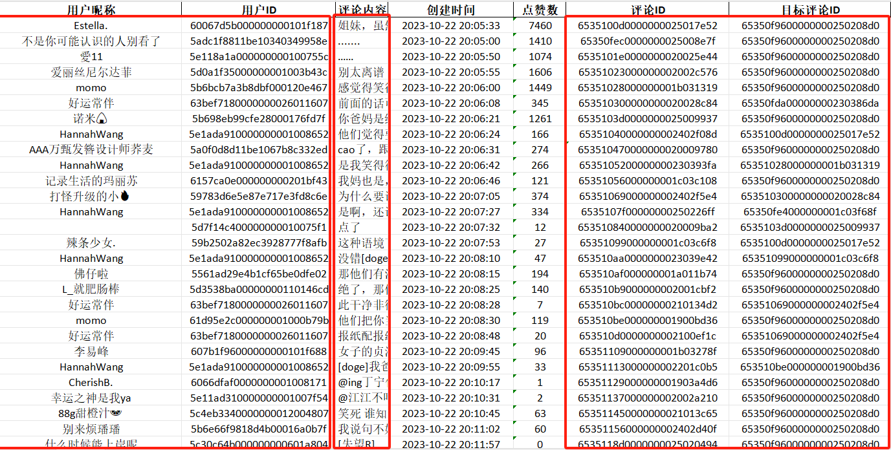
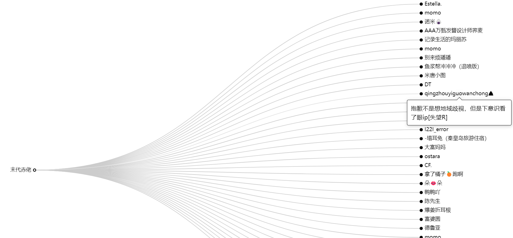
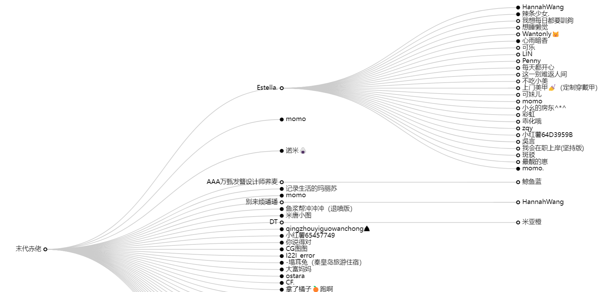

一、概述

这是一个将评论信息可视化的项目信息，用于更好的呈现热门评论的回复情况。

依托项:echarts https://echarts.apache.org/zh/index.html

二、依赖

详见requirements.txt

终端安装:pip install -r requirements.txt

三、使用方法

1、将节点信息存储到excel文件，格式参考如下

需要包含主要这五列信息

2、运行main程序，参数解析：

（1）设置初节点信息

（2）设置层级关系，层级小的评论将会剔除

3、生成评论树结构.json文件

4、在浏览器打开model.html文件即可查看

（1）鼠标放置在节点上面即可出现评论内容

（2）点击节点即可展开下面的评论内容

四、更改

如果您想在此基础之上更改用途，只需要调整demo.xlsx文件即可，确保五部分数据对应
